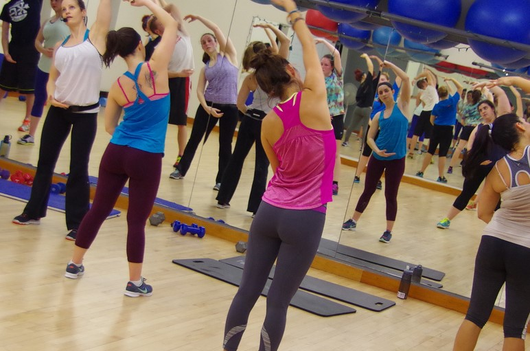

#Group Exercise Memberships 

For group exercise classes, there are yearly and semester memberships available. If you are a faculty or staff member, you must purchase a McComas membership to attend classes held in McComas.

##Yearly Memberships
* For year-round access to all group exercise classes in both McComas and War Memorial, it costs $85.
* For year-round access to all group exercise classes in War Memorial, it costs $50.
* For year-round access to all mind+body classes in McComas and War Memorial, it costs $50. Mind+body classes include yoga, pilates, Tai Chi, and BODYFLOW.

##Semester Memberships
* For access to all group exercise classes in McComas and War Memorial for one semester, it costs $50.
* For access to all group exercise classes in War Memorial for one semester, it costs $30.
* For access to all mind+body classes in McComas and War Memorial for one semester, it costs $30.

