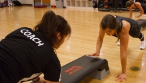
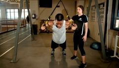
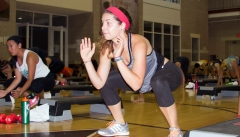
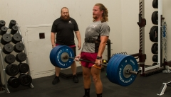
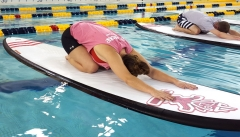

# Small Group Training

If you are looking for a way to start working out, shake up your workout routine, or find folks to work out with, small group training might be for you.

Small group training is a six-week exercise program that meets twice a week with a dedicated coach and three to 12 group members.

## Les Mills GRIT™ Series

A fitness program that takes cutting edge High Intensity Interval Training (HIIT) and combines it with powerful music and inspirational coaches who will be down on the floor with you, motivating you to go harder.

## Hokie RunFit

In this hands-on program, you will receive training from experienced coaches on how to improve your running techniques. Through educational discussions and weekly workouts, you will gain the knowledge needed to become a better performer, no matter your fitness level! 
 
## TRX

A unique suspension-based resistance program will help improve strength, balance, flexibility, coordination, endurance, and joint stability. Developed by a Navy Seal, you’ll use your own bodyweight to transform your body. Using your hands and feet as anchor points, you’ll practice hundreds of versatile exercises that are challenging and accommodate all fitness levels and performance goals.

## X-Fit

A program designed to challenge you mentally and physically by constantly varying your workout. Workouts consist of high intensity, functional movements that incorporate aerobic exercise, gymnastics (body weight exercises), and weight lifting exercises to help you get in the best shape of your life.

## Intro to Olympic Lifting 

A program to teach you the essentials to perfect the art of weight lifting. You will learn the appropriate sequences for each skill, their progressions, and the types of training programs an athlete should follow. The lifts taught will be clean, jerk, snatch, plus intermediate progressions. 

## Stand Up Paddle Board (SUP) Yoga

A program with stand up paddle surfing, combined with yoga. The sport combines hatha yoga and vinyasa yoga asanas, or poses, with surfing. During SUP Yoga, you will be doing yoga poses on a paddleboard in the pool.
  
For more information about the programs, the coaches, and how to sign up, visit our Small Group Training [Formats + Schedule Page](http://www.recsports.vt.edu/getactive/smallgroup/formatdescriptions.html).

