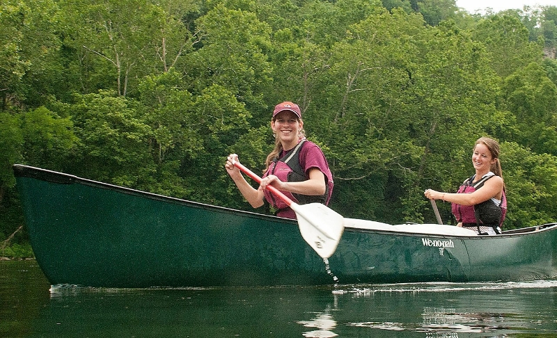
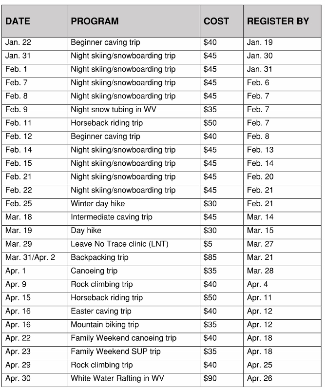

# Venture Out

Venture Out is a great way to go on outdoor trips without having to do the planning.

## Trips and Programs

We offer a variety of trips and programs throughout the year.

For more information on how to sign up, visit our [Trips + Programs Page](http://www.recsports.vt.edu/getactive/outdoorrecreation/tripsandprograms.html).

## Equipment Rentals

You can also rent equipment from us to go on your own adventures. For more information about how to rent, visit our [Rental Information Page](http://www.recsports.vt.edu/getactive/outdoorrecreation/rentals.html).

For details about the equipment we have and rental prices, visit our [Rental Rates Page](http://www.recsports.vt.edu/getactive/outdoorrecreation/rentalrates.html). There you will find daily, weekend, and 4-day pricing for over 20 types of camping and other outdoor equipment. 

